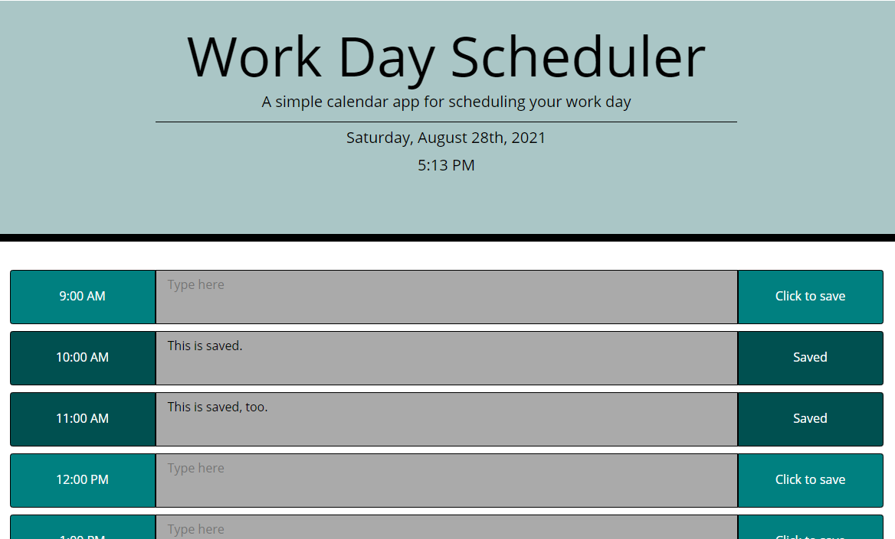

# Work Day Scheduler

## Application Link
<https://griveroll86.github.io/scheduler/>

## Work Day Scheduler
This assignment asked us to modify starter code to create an hourly scheduler of a typical business work day (9AM-5PM) that allowed events to be typed and saved. Saving an event would require the entered text be displayed upon reloading the page using local storage. Each hour block must be color coded depending if it's the current, past or future hour. When an event is saved, the text field becomes read-only. Clicking the save button again will unlock the text field and allow the event to be edited. The save button and hour display changes color to identify when it is locked/saved as well as the save button text changing.

## Files Edited
* index.html
* style.css
* script.js

## Libraries Used
* Moment.js
* Bootstrap
* jQuery

## Preview Image
